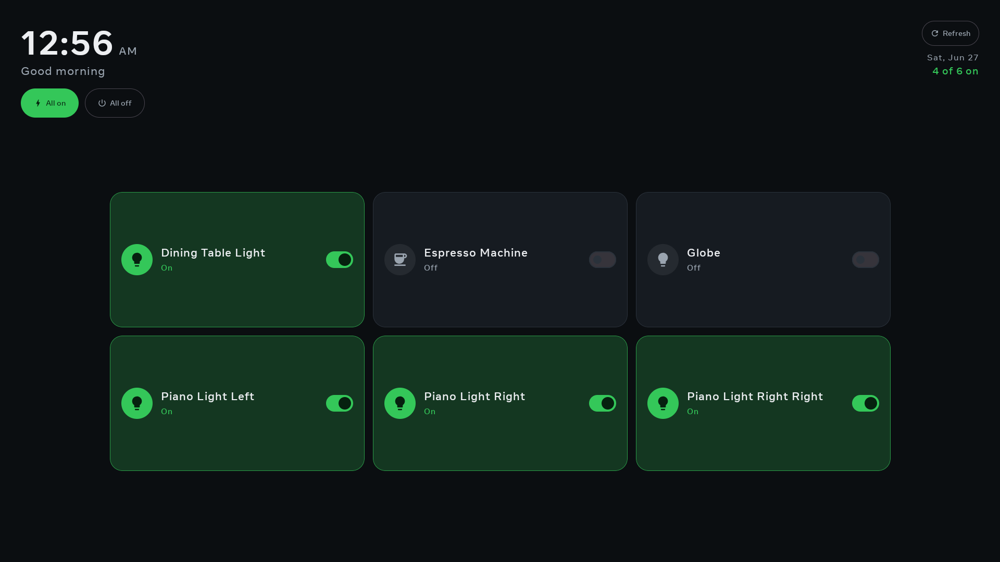

# Portal-Kasa

A TP-Link **Kasa** smart-plug controller for the Meta Portal.

- **UI** — see every plug on your Wi-Fi and toggle each on/off. No sign-in.
- **Voice** — [Jarvis](https://github.com/rudysev/portal-assistant) can turn a plug on or off by name ("hey jarvis, turn on the coffee maker").

<p align="center">
  <br>
  <sub><b>Dashboard</b> — every plug on your Wi-Fi, glanceable on/off (green = on), with a one-tap All&nbsp;on / All&nbsp;off. Shown on a Portal+.</sub>
</p>

## How it works

Control is **local LAN** — no TP-Link account, no cloud. Plugs listen on port **9999** speaking an
autokey-XOR'd JSON protocol. The app **discovers** plugs by UDP-broadcasting `get_sysinfo` (each reply
carries the plug's alias + relay state), and flips one over TCP with `set_relay_state`.

A few robustness details worth knowing:

- **Lossy-discovery tolerant.** Broadcast UDP drops replies, so discovery re-broadcasts across its window
  (under a `MulticastLock`) and `PlugMerge` *merges* each sweep with the current list — a plug that misses a
  cycle keeps its card until several misses in a row, so plugs don't flicker in and out. Results are
  alias-sorted for a stable order.
- **Background sync.** While the screen is open the list re-syncs every ~30s, so changes made elsewhere (the
  Kasa app, a physical button, voice from another device) show up — without snapping back an in-flight tap.

> **Same Wi-Fi only.** The Portal and the plugs must be on the same network. A plug that's offline or on
> another network won't be discovered.

## Install

The easy way — no building, no command line:

1. On the Portal, open **Settings → Debug** and turn on **ADB Enabled**.
2. Connect the Portal to your computer with a **USB‑C cable**.
3. [Download this repository as a ZIP](https://github.com/rudysev/portal-kasa/archive/refs/heads/main.zip)
   and unzip it.
4. Open the `provisioning` folder and double-click **`Install-PortalKasa.command`** (macOS) or
   **`Install-PortalKasa.bat`** (Windows).
5. When the Portal asks **"Allow USB debugging?"**, tap **Allow**.

The installer downloads Android's `adb` if needed, downloads the app, installs it, and opens it. Plugs on
the same Wi-Fi are listed automatically. To remove it, double-click **`Uninstall-PortalKasa`**. See
[`provisioning/README.md`](provisioning/README.md) for details and troubleshooting.

## Voice setup

1. Install (above) and open the app once so it discovers your plugs.
2. In the assistant: **Settings → External tools → enable "Kasa Plugs"**.
3. Start a **new** conversation (the assistant snapshots tools at session start), then ask it to turn a plug
   on/off by its Kasa name.

## Build / run

For developers with a JDK 21 toolchain and the Android SDK: build, install, and launch on a USB-connected
Portal (with **Settings → Debug → ADB Enabled**) in one step —

```bash
./setup.sh
```

`setup.sh` builds the debug APK if it's missing, then installs and launches it via
[hzdb](https://github.com/meta-quest/hzdb).

## Notes

- No credentials are stored — local control needs none.
- v1 is **plugs only** — groups (app-defined) are a possible follow-up. Energy monitoring isn't supported
  (the EP10 has no metering; KP115/HS300 do).

<p align="center">
  <a href="https://buymeacoffee.com/linuxbarista"></a>
</p>

## Disclaimer

portal-kasa is an independent community project — **not affiliated with, endorsed by, or
sponsored by Meta or TP-Link**. "Meta Portal" / "Portal" are trademarks of Meta Platforms,
Inc.; "TP-Link" / "Kasa" are trademarks of TP-Link Corporation Limited — used here only to
identify the hardware this app runs on and the plugs it controls. The app installs on
discontinued devices and switches mains power to whatever you plug in, so it is
**use-at-your-own-risk** (may void warranty; no guarantees). All control is **local-LAN only**
— no cloud, no accounts, no credentials stored. See [DISCLAIMER.md](DISCLAIMER.md) for the full
text and privacy notes.
